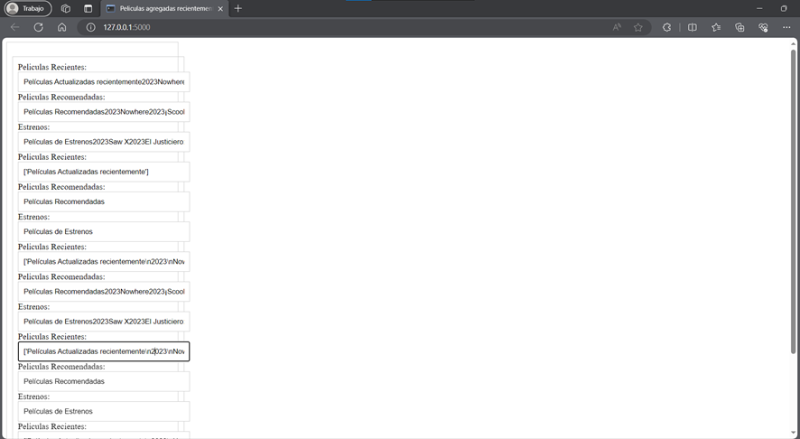

# Trabajo Final Tratamiento de Datos

Descripcion del trabajo: Se ha elaborado un analisis y tratamiento de datos con el objetivo de obtener una informacion de una pagina guardarla en una Base de Datos no relacional y mostrarla mediante una API.


## Autor
Morales Panta Wellington Xavier

- [@wmorales2020](https://www.github.com/wmorales2020)


## Instalacion

Los prerequisitos que se debe de instalar son :

```bash
    selenium
    pymongo
    python-dotenv
    flask
```


## Documentacion
Dificultades:
Dentro de los principales desafios presentados en la tarea fue la eleccion de la pagina y encontrar el id o la clase contenedora y hacer estas pruebas para lograr obtener la informacion.
Se utilizo segun lo explicado en clase MongoDB para guardar la informacion junto a Phyton y flask para el Api

## CASO
Se pretende realizar un scraping a la pagina de PeliPluss con el objetivo de obtener el nombre de las peliculas mas reciente y recomendadas de esta pagina

## Analisis de la pagina

Se obtiene el contenido de la pagina con las siguientes sentencias de codigo de la URL: https://pelisplus.ai/

```bash
    
    driver = webdriver.Chrome()
    driver.get("https://pelisplus.ai/")
    panel_conte = driver.find_elements(By.CLASS_NAME,"main__right")
```
Con la inspeccion que se le dio a la pagina pudimos verificar que el nombre de la clase que contenia la informacion de interes estaba en main__right.

Ahora para recorrer toda la informacion utilizamos for

```bash
    for a in panel_conte:
    #encabez = a.find_element(by=By.TAG_NAME, value="message")
    agg_reciente = a.find_element(by=By.CSS_SELECTOR, value="#wrapper__main > div.main__right > div:nth-child(2)").text.split(",")
    recomenda= a.find_element(by=By.CSS_SELECTOR, value="#wrapper__main > div.main__right > div:nth-child(3)").text
    estrenos = a.find_element(by=By.CSS_SELECTOR, value="#wrapper__main > div.main__right > div.index-module__box___Lufb8.box--slider").text
    print(agg_reciente)
```

En donde con el id de CSS_SELECTOR obtuvimos la informacion detallada de las peliculas clasificadas en recientes, recomendadas y estrenos

```bash
    document = {
        "agg_reciente": agg_reciente,
        "recomenda": recomenda,
        "estrenos": estrenos,

    }
```
Luego lo agregamos a la variable document para despues enviar e insertar

```bash
col.insert_one(document=document)

```
## Configuramos nuestra Api

Se realiza la configuracion de donde obtengo la informacion y como la paso al Api

```bash
    @app.route('/')
def index():
    peliculas_data=col.find({})
    return render_template('contenedor.html', peliPuss=peliculas_data)
```
En la que todo lo obtenido con la variable col que es la que contiene la informacion sacada de la coleccion de base de datos lo pasamos a un html para ser mostrado.

```bash
    <div class="contenedor">
        <ul class="contenedor">
            
            <label for="peliPuss" >Peliculas Recientes:</label>
            <input class="contenedor" id="peliPuss" name="peliPuss" value="{{peliPuss.agg_reciente}}" ">
            <label for="peliPuss" >Peliculas Recomendadas:</label>
            <input class="contenedor" id="peliPuss" name="peliPuss" value="{{peliPuss.recomenda}}" ">
            <label for="peliPuss" >Estrenos:</label>
            <input class="contenedor" id="peliPuss" name="peliPuss" value="{{peliPuss.estrenos}}" ">
            
        </ul>
    </div>
```
Adicional del estilo y del contenido del html aqui tenemos el codigo con la variable PeliPluss que es la contenedora de la informacion para mostrar.
y al final tenemos el resultado que si pretendemos tener una pagina informativa con los nombres de peliculas recomendadas se puede tener un bot para mostrar obtenidas siempre de esta pagina dedicada a eso.
